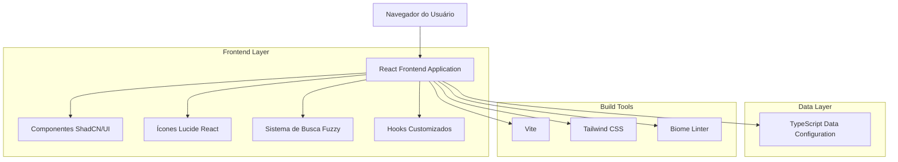
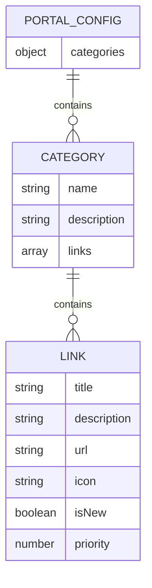
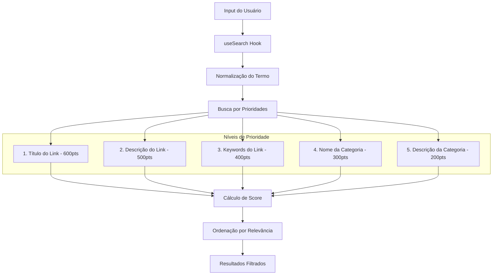

# Arquitetura Técnica - Portal do Servidor

## 1. Architecture design



## 2. Technology Description

* **Frontend**: React\@19 + TypeScript + Vite\@5

* **UI Framework**: ShadCN/UI + Tailwind CSS\@4

* **Ícones**: Lucide React

* **Build Tool**: Vite

* **Styling**: Tailwind CSS com configuração customizada

* **Linting**: Biome (formatação e linting de código)

* **Storage**: localStorage (for theme preferences)

* **Data Management**: TypeScript configuration file (portal-links.ts)

* **Search Engine**: Custom fuzzy search with 5-level priority system

* **Deployment**: Build estático para hospedagem web

### 2.1 Code Quality & Linting

O projeto utiliza **Biome** como ferramenta principal para linting e formatação de código:

* **Configuração**: `biome.json` com regras específicas para TypeScript/React

* **Comando de lint**: `pnpm lint` (executa `biome check --write ./src`)

* **Formatação automática**: Biome aplica formatação automática durante o lint

* **Integração com Git**: VCS habilitado para ignorar arquivos do .gitignore

* **Suporte CSS**: Parser configurado para Tailwind CSS directives

**Regras importantes:**

* Indentação: Tabs

* Aspas: Duplas para JavaScript/TypeScript

* Formatação automática aplicada em todos os arquivos

* Verificação de variáveis não utilizadas

* Validação de imports e exports

## 3. Route definitions

| Route | Purpose                                                                |
| ----- | ---------------------------------------------------------------------- |
| /     | Página principal do portal com todas as categorias e links organizados |

## 4. API definitions

Não aplicável - O projeto utiliza configuração estática via JSON local.

## 5. Server architecture diagram

Não aplicável - Aplicação frontend estática sem backend.

## 6. Data model

### 6.1 Data model definition



### 6.2 Data Definition Language

**Estrutura do arquivo TypeScript de configuração (portal-links.ts)**

```typescript
import { LucideIcon } from "lucide-react";

// Tipos TypeScript para o projeto
interface LinkItem {
  title: string;
  description: string;
  url: string;
  icon: LucideIcon;
  keywords: string[];
}

interface Category {
  name: string;
  description: string;
  links: LinkItem[];
}

interface PortalConfig {
  management: Category;
  utilities: Category;
  support: Category;
}

// Exemplo da estrutura de dados atual
export const portalConfig: PortalConfig = {
  management: {
    name: "Sistemas de Gestão Pública",
    description: "Sistemas para gestão administrativa e operacional",
    links: [
      {
        title: "Sistema Administrativo",
        description: "Gestão de processos administrativos, documentos e tramitações internas da prefeitura",
        url: "https://admin.barramansa.rj.gov.br",
        icon: Building2,
        keywords: [
          "administrativo", "admin", "administracao", "gestao", "gerencia",
          "processos", "documentos", "tramitacao", "tramitacoes", "interno",
          "prefeitura", "municipal", "orgao", "secretaria", "departamento"
        ]
      }
      // ... mais links
    ]
  },
  utilities: {
    name: "Utilidades",
    description: "Ferramentas e serviços úteis para o dia a dia",
    links: [
      // ... links de utilidades
    ]
  },
  support: {
    name: "Suporte TI",
    description: "Suporte técnico e solicitações especializadas",
    links: [
      // ... links de suporte
    ]
  }
};
```

## 7. Sistema de Busca Fuzzy

### 7.1 Arquitetura do Sistema de Busca



### 7.2 Sistema de Pontuação

**Tipos de Correspondência:**

* **Correspondência exata**: 100 pontos

* **Começa com o termo**: 90 pontos

* **Contém o termo**: 70 pontos

* **Correspondência parcial**: 30 pontos por palavra

**Multiplicadores de Prioridade:**

* Título do Link: 6x (600+ pontos)

* Descrição do Link: 5x (500+ pontos)

* Keywords do Link: 4x (400+ pontos)

* Nome da Categoria: 3x (300+ pontos)

* Descrição da Categoria: 2x (200+ pontos)

### 7.3 Funcionalidades Avançadas

* **Busca sem acentos**: Normalização automática de caracteres especiais

* **Tolerância a erros**: Keywords expandidas com variações comuns

* **Priorização inteligente**: Links específicos têm prioridade sobre categorias

* **Busca em tempo real**: Resultados instantâneos conforme digitação

* **Fallback inteligente**: Se não encontrar links específicos, mostra categoria completa

