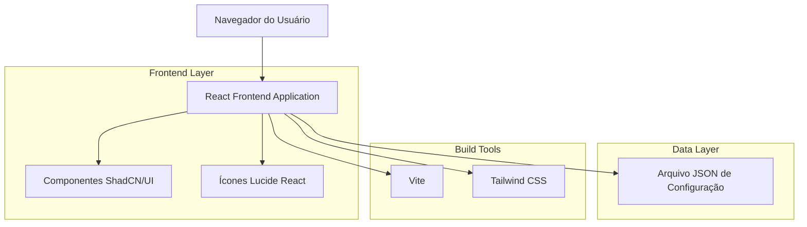
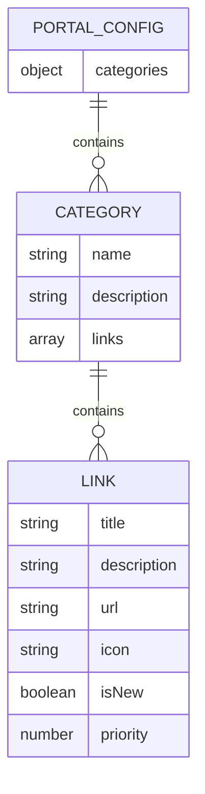

# Arquitetura Técnica - Portal do Servidor

## 1. Architecture design



## 2. Technology Description

- **Frontend**: React@18 + TypeScript + Vite@5
- **UI Framework**: ShadCN/UI + Tailwind CSS@3
- **Ícones**: Lucide React
- **Build Tool**: Vite
- **Styling**: Tailwind CSS com configuração customizada
- **Storage**: localStorage (for theme preferences, future favorites)
- **Deployment**: Build estático para hospedagem web

## 3. Route definitions

| Route | Purpose |
|-------|---------|
| / | Página principal do portal com todas as categorias e links organizados |

## 4. API definitions

Não aplicável - O projeto utiliza configuração estática via JSON local.

## 5. Server architecture diagram

Não aplicável - Aplicação frontend estática sem backend.

## 6. Data model

### 6.1 Data model definition



### 6.2 Data Definition Language

**Estrutura do arquivo JSON de configuração (portal-config.json)**

```json
{
  "siteInfo": {
    "title": "Portal do Servidor",
    "subtitle": "Prefeitura Municipal de Barra Mansa",
    "logo": "/logo-prefeitura.png"
  },
  "categories": {
    "management": {
      "name": "Sistemas de Gestão Pública",
      "description": "Acesso aos principais sistemas administrativos da prefeitura",
      "priority": 1,
      "links": [
        {
          "title": "Protocolo",
          "description": "Sistema de protocolo de documentos",
          "url": "https://protocolo.barramansa.rj.gov.br",
          "icon": "FileText",
          "isNew": false,
          "priority": 1
        },
        {
          "title": "Administrativo",
          "description": "Gestão administrativa e processos",
          "url": "https://admin.barramansa.rj.gov.br",
          "icon": "Settings",
          "isNew": false,
          "priority": 2
        },
        {
          "title": "Contábil",
          "description": "Sistema de gestão contábil",
          "url": "https://contabil.barramansa.rj.gov.br",
          "icon": "Calculator",
          "isNew": false,
          "priority": 3
        }
      ]
    },
    "utilities": {
      "name": "Utilidades",
      "description": "Ferramentas e recursos úteis para o dia a dia",
      "priority": 2,
      "links": [
        {
          "title": "WEBMAIL",
          "description": "Sistema de email corporativo",
          "url": "https://webmail.barramansa.rj.gov.br",
          "icon": "Mail",
          "isNew": false,
          "priority": 1
        },
        {
          "title": "Portal da Transparência",
          "description": "Informações públicas e transparência",
          "url": "https://transparencia.barramansa.rj.gov.br",
          "icon": "Globe",
          "isNew": false,
          "priority": 2
        },
        {
          "title": "Contracheque Online",
          "description": "Consulta de contracheque online",
          "url": "https://contracheque.barramansa.rj.gov.br",
          "icon": "FileText",
          "isNew": false,
          "priority": 3
        },
        {
          "title": "Pedido de Toner",
          "description": "Formulário para solicitação de toner",
          "url": "https://forms.google.com/toner-request",
          "icon": "Printer",
          "isNew": true,
          "priority": 4
        }
      ]
    },
    "support": {
      "name": "Suporte TI",
      "description": "Central de ajuda e suporte técnico",
      "priority": 3,
      "links": [
        {
          "title": "Suporte TI",
          "description": "Central de suporte técnico",
          "url": "https://suporte.barramansa.rj.gov.br",
          "icon": "HelpCircle",
          "isNew": false,
          "priority": 1
        },
        {
          "title": "Criação de Usuário",
          "description": "Solicitação de criação de usuário",
          "url": "https://suporte.barramansa.rj.gov.br/usuario",
          "icon": "UserPlus",
          "isNew": false,
          "priority": 2
        },
        {
          "title": "Criação de Email",
          "description": "Solicitação de criação de email",
          "url": "https://suporte.barramansa.rj.gov.br/email",
          "icon": "Mail",
          "isNew": false,
          "priority": 3
        }
      ]
    }
  },
  "footer": {
    "municipality": "Município de Barra Mansa",
    "cnpj": "28.695.658/0001-84",
    "phone": "(24) 2106-3400",
    "email": "ouvidoria@barramansa.rj.gov.br",
    "address": "Rua Luiz Ponce, 263 - Centro, Barra Mansa - RJ, 27310-400",
    "credits": "Desenvolvido pela equipe de TI da Prefeitura",
    "copyright": "Copyright 2024 | Todos os Direitos Reservados | Prefeitura Municipal de Barra Mansa"
  }
}
```

**Estrutura de Componentes React**

```typescript
// Tipos TypeScript para o projeto
interface LinkItem {
  title: string;
  description: string;
  url: string;
  icon: string;
  isNew?: boolean;
  priority?: number;
}

interface Category {
  name: string;
  description: string;
  priority?: number;
  links: LinkItem[];
}

interface SiteInfo {
  title: string;
  subtitle: string;
  logo: string;
}

interface FooterInfo {
  municipality: string;
  cnpj: string;
  phone: string;
  email: string;
  address: string;
  credits: string;
  copyright: string;
}

interface PortalConfig {
  siteInfo: SiteInfo;
  categories: Record<string, Category>;
  footer: FooterInfo;
}
```