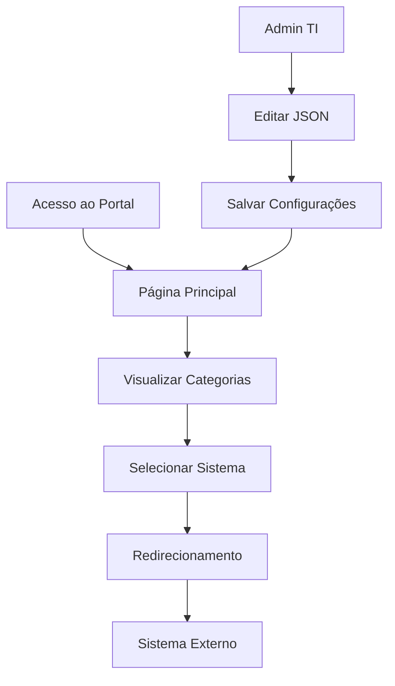

# Portal do Servidor - Prefeitura de Barra Mansa

## 1. Product Overview

Portal moderno e responsivo para servidores públicos da Prefeitura de Barra Mansa acessarem rapidamente os principais sistemas e serviços utilizados no dia a dia.

O portal resolve o problema de dispersão de links e sistemas, centralizando o acesso em uma interface moderna, intuitiva e de fácil manutenção. Destinado aos servidores municipais que precisam acessar múltiplos sistemas administrativos, de gestão e suporte.

O objetivo é modernizar a experiência do usuário e facilitar a manutenção técnica através de configuração JSON, reduzindo o tempo de atualização de links e adição de novos serviços.

## 2. Core Features

### 2.1 User Roles

| Role | Registration Method | Core Permissions |
|------|---------------------|------------------|
| Servidor Público | Acesso direto via URL | Pode visualizar e acessar todos os links disponíveis |
| Administrador TI | Acesso ao código/JSON | Pode editar configurações, adicionar/remover links e categorias |

### 2.2 Feature Module

Nosso portal consiste nas seguintes páginas principais:

1. **Página Principal**: header com logo e título, seções de categorias organizadas, cards de links com ícones e descrições, footer institucional.

### 2.3 Page Details

| Page Name | Module Name | Feature description |
|-----------|-------------|---------------------|
| Home page | Header | Display municipal logo, portal title, theme toggle (light/dark mode), search bar for real-time link filtering |
| Home page | Categories Section | Display organized link categories (Management Systems, Utilities, IT Support) with responsive card layout |
| Home page | Link Cards | Interactive cards with system icons, titles, descriptions, hover effects, tooltips, and accessibility features |
| Home page | Footer | Municipal information, contact details, development credits |
| Página Principal | Animações | Implementar animações suaves de hover, carregamento e transições |

## 3. Core Process

**Fluxo Principal do Usuário:**
1. Servidor acessa o portal via URL
2. Visualiza as categorias organizadas de sistemas
3. Localiza o sistema desejado através da navegação visual ou busca
4. Clica no card do sistema para ser redirecionado
5. Sistema abre em nova aba mantendo o portal disponível

**Fluxo de Administração:**
1. Administrador TI acessa o arquivo JSON de configuração
2. Adiciona, edita ou remove links e categorias
3. Salva as alterações
4. Portal é automaticamente atualizado na próxima visualização

## 4. User Interface Design

### 4.1 Design Style
O portal seguirá o design system da Prefeitura de Barra Mansa com as seguintes características:

**Modo Claro (Padrão):**
- Fundo: Azul Institucional #1E40AF
- Cards: Branco #FFFFFF com sombras suaves
- Texto: Azul Escuro #1E3A8A
- Acentos: Cinza Claro #F8FAFC

**Modo Escuro:**
- Fundo: Cinza Escuro #1F2937
- Cards: Cinza Médio #374151
- Texto: Branco #FFFFFF / Cinza Claro #F9FAFB
- Acentos: Azul Suave #3B82F6

**Tipografia:**
- Fonte Principal: Inter ou system fonts
- Títulos: 24px-32px (bold)
- Subtítulos: 18px-20px (medium)
- Texto corpo: 14px-16px (regular)

**Componentes:**
- Cards com bordas arredondadas (8px)
- Hover effects animados
- Tooltips informativos
- Ícones do Lucide React (24px padrão)

**Acessibilidade:**
- ARIA labels em todos elementos
- Navegação por teclado (Tab, Enter, Esc)
- Alto contraste nas cores
- Focus indicators visíveis

**Layout:**
- Grid responsivo (1-2-3-4 colunas)
- Espaçamento consistente (16px, 24px, 32px)
- Mobile-first design

### 4.2 Page Design Overview

| Page Name | Module Name | UI Elements |
|-----------|-------------|-------------|
| Página Principal | Header | Logo da prefeitura (esquerda), título "Portal do Servidor" (centro), toggle tema e busca (direita) |
| Página Principal | Busca | Campo de busca com ícone, placeholder "Buscar sistemas...", filtro em tempo real |
| Página Principal | Cards de Links | Grid responsivo, cards com hover effects, tooltips, ícones Lucide, acessibilidade completa |
| Página Principal | Footer | Informações municipais, contato, créditos da equipe TI |

### 4.3 Responsiveness

Portal desenvolvido com abordagem mobile-first, totalmente responsivo:
- **Mobile (320-768px)**: 1 coluna, cards full-width, navegação simplificada
- **Tablet (768-1024px)**: 2 colunas, header compacto
- **Desktop (1024px+)**: 3-4 colunas, layout completo com espaçamentos generosos
- **Interação Touch**: Cards otimizados para toque, áreas de clique amplas (min 44px)