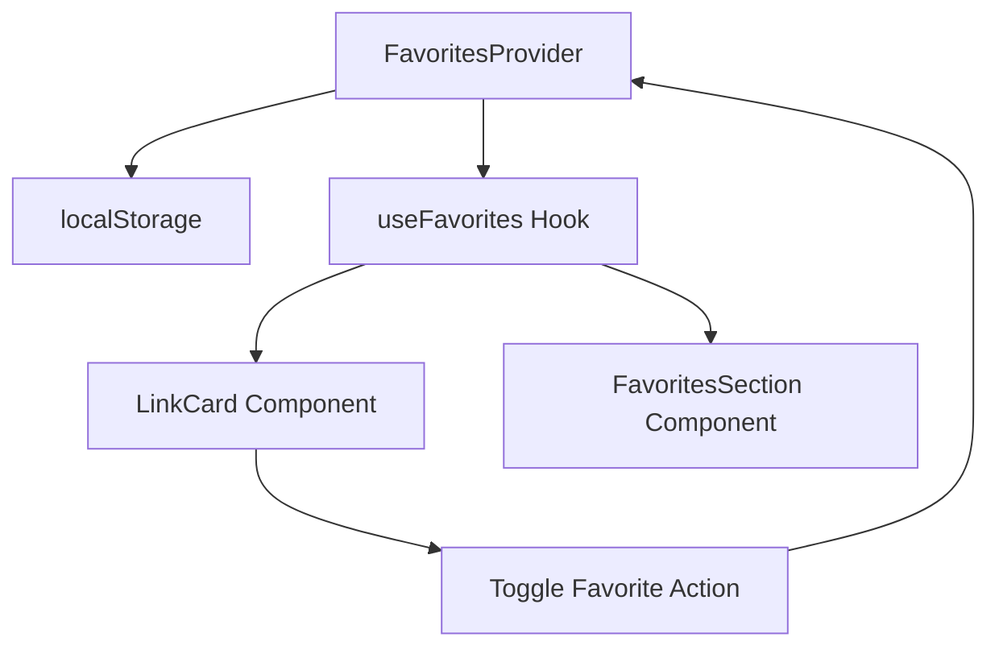

# Sistema de Favoritos - Portal do Servidor

## 1. Visão Geral

O sistema de favoritos permitirá que os usuários marquem links como favoritos para acesso rápido, melhorando a experiência do usuário ao facilitar o acesso aos sistemas mais utilizados.

## 2. Funcionalidades

### 2.1 Funcionalidades Principais
- **Marcar/Desmarcar Favoritos**: Usuários podem adicionar ou remover links dos favoritos
- **Persistência Local**: Favoritos são salvos no localStorage do navegador
- **Seção de Favoritos**: Exibição dedicada dos links favoritos
- **Indicador Visual**: Ícone de estrela para mostrar status de favorito
- **Contador de Favoritos**: Badge mostrando quantidade de favoritos

### 2.2 Experiência do Usuário
- Clique no ícone de estrela para adicionar/remover favorito
- Seção "Meus Favoritos" no topo da página (quando houver favoritos)
- Animações suaves para feedback visual
- Acessibilidade completa com ARIA labels

## 3. Arquitetura Técnica

### 3.1 Estrutura de Arquivos
```
src/
├── contexts/
│   └── FavoritesContext.tsx     # Context para gerenciar favoritos
├── hooks/
│   └── useFavorites.ts          # Hook para usar o contexto
├── components/
│   ├── FavoritesSection.tsx     # Seção de favoritos
│   └── LinkCard.tsx             # Já tem base implementada
└── types/
    └── index.ts                 # Já tem FavoritesContextType
```

### 3.2 Fluxo de Dados


## 4. Implementação Detalhada

### 4.1 Context de Favoritos (FavoritesContext.tsx)
```typescript
interface FavoritesContextType {
  favorites: string[];
  toggleFavorite: (id: string) => void;
  isFavorite: (id: string) => boolean;
  getFavoriteLinks: (allLinks: Link[]) => Link[];
  clearFavorites: () => void;
}
```

**Responsabilidades:**
- Gerenciar estado global dos favoritos
- Persistir no localStorage
- Fornecer métodos para manipular favoritos

### 4.2 Hook useFavorites (useFavorites.ts)
```typescript
export function useFavorites() {
  const context = useContext(FavoritesContext);
  if (!context) {
    throw new Error('useFavorites must be used within FavoritesProvider');
  }
  return context;
}
```

### 4.3 Componente FavoritesSection (FavoritesSection.tsx)
- Exibe grid de links favoritos
- Aparece apenas quando há favoritos
- Usa mesmo layout do CategorySection
- Animação de entrada suave

### 4.4 Integração no App.tsx
- Envolver aplicação com FavoritesProvider
- Adicionar FavoritesSection no topo (quando houver favoritos)
- Manter estrutura existente

## 5. Persistência de Dados

### 5.1 LocalStorage
```typescript
// Chave: 'portal-favorites'
// Valor: string[] (array de IDs dos favoritos)
// Exemplo: ['management-0', 'utilities-3', 'support-1']
```

### 5.2 Sincronização
- Carregamento inicial do localStorage
- Salvamento automático a cada mudança
- Fallback para array vazio se não existir

## 6. Interface do Usuário

### 6.1 Ícone de Favorito no LinkCard
- Ícone: Star (Lucide React)
- Estados: vazio (não favorito) / preenchido (favorito)
- Cores: cinza (inativo) / amarelo (ativo)
- Posição: canto superior direito do card
- Animação: hover e click

### 6.2 Seção de Favoritos
- Título: "Meus Favoritos" com ícone de estrela
- Layout: Grid responsivo (mesmo do CategorySection)
- Posição: Acima das categorias principais
- Animação: Fade in quando aparecer

### 6.3 Estados Visuais
- **Sem favoritos**: Seção não aparece
- **Com favoritos**: Seção visível com grid de cards
- **Hover no ícone**: Escala e mudança de cor
- **Favorito adicionado**: Animação de preenchimento da estrela

## 7. Acessibilidade

### 7.1 ARIA Labels
- `aria-label` para botão de favorito
- `aria-pressed` para estado do favorito
- `role="button"` para interação

### 7.2 Navegação por Teclado
- Tab para focar no ícone de favorito
- Enter/Space para toggle
- Foco visível com outline

## 8. Performance

### 8.1 Otimizações
- useMemo para filtrar links favoritos
- useCallback para funções de toggle
- Lazy loading da seção de favoritos
- Debounce no localStorage (se necessário)

## 9. Testes e Validação

### 9.1 Cenários de Teste
1. **Adicionar favorito**: Clicar na estrela vazia
2. **Remover favorito**: Clicar na estrela preenchida
3. **Persistência**: Recarregar página e verificar favoritos
4. **Seção de favoritos**: Aparecer/desaparecer conforme necessário
5. **Responsividade**: Testar em diferentes tamanhos de tela
6. **Acessibilidade**: Navegação por teclado e screen readers

### 9.2 Validação de UX
- Feedback visual imediato ao clicar
- Animações suaves e não intrusivas
- Posicionamento intuitivo dos controles
- Performance fluida em dispositivos móveis

## 10. Cronograma de Implementação

### Fase 1: Estrutura Base (30 min)
1. Criar FavoritesContext.tsx
2. Criar useFavorites.ts
3. Integrar Provider no App.tsx

### Fase 2: Funcionalidade Core (45 min)
1. Implementar lógica de toggle no LinkCard
2. Adicionar persistência localStorage
3. Testar funcionalidade básica

### Fase 3: Interface de Favoritos (30 min)
1. Criar FavoritesSection.tsx
2. Integrar no App.tsx
3. Ajustar estilos e animações

### Fase 4: Refinamentos (15 min)
1. Testes finais
2. Ajustes de acessibilidade
3. Otimizações de performance

**Tempo Total Estimado: 2 horas**

## 11. Considerações Futuras

### 11.1 Melhorias Possíveis
- Sincronização com backend (futuro)
- Categorias de favoritos
- Ordenação personalizada
- Exportar/importar favoritos
- Estatísticas de uso dos favoritos

### 11.2 Integração com Analytics
- Rastrear favoritos mais populares
- Tempo de uso dos favoritos
- Padrões de comportamento do usuário